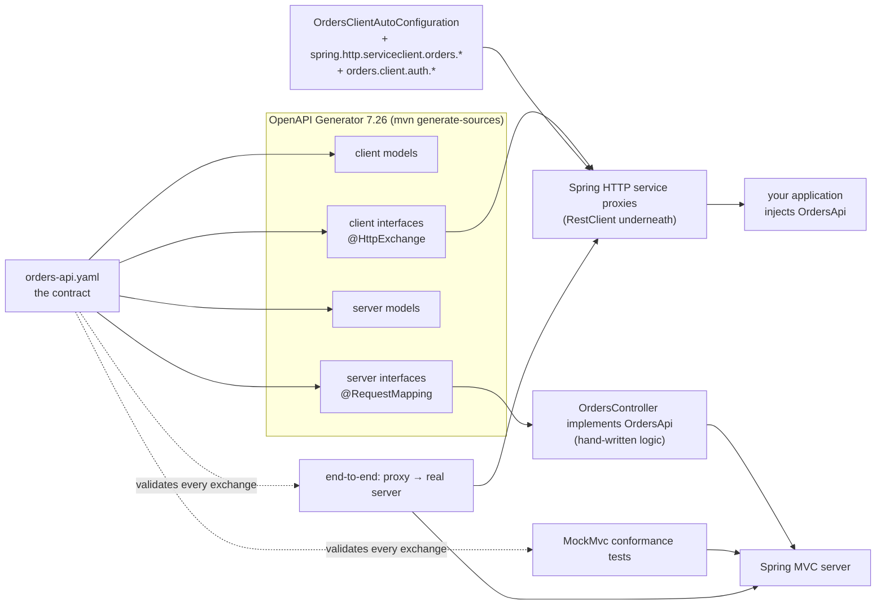
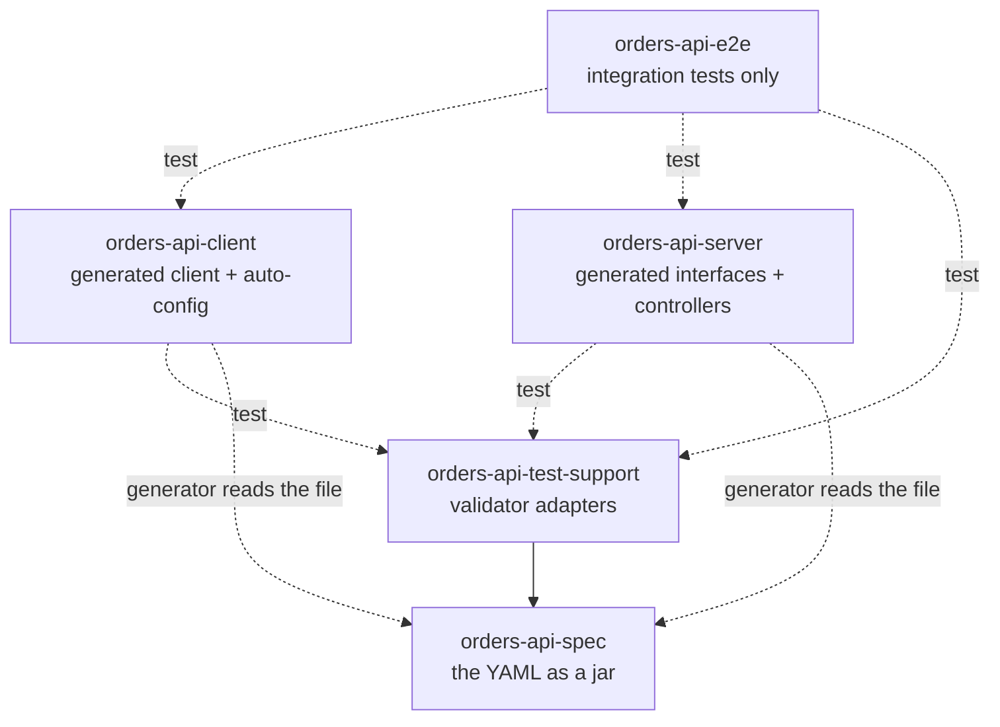

# contract-first-spring

[](https://github.com/dmitrykislov/contract-first-spring/actions/workflows/ci.yml)
[](LICENSE)
 

**One OpenAPI document. From it, every build produces the Java models, Spring declarative HTTP clients that are
configured purely by properties, the server interfaces that controllers must implement, and tests that prove client
and server both follow the contract.**

```bash
git clone https://github.com/dmitrykislov/contract-first-spring.git && cd contract-first-spring
mvn verify     # generate → compile → 100+ tests, every HTTP exchange validated against the spec
```

## Contents

1. [The problem](#1-the-problem)
2. [The whole picture in one diagram](#2-the-whole-picture-in-one-diagram)
3. [From OpenAPI spec to declarative clients](#3-from-openapi-spec-to-declarative-clients)
4. [Configuring the clients: base URL, timeouts, TLS, authentication](#4-configuring-the-clients)
5. [From OpenAPI spec to server controllers](#5-from-openapi-spec-to-server-controllers)
6. [How we know both sides follow the spec](#6-how-we-know-both-sides-follow-the-spec)
7. [Modules and who depends on what](#7-modules-and-who-depends-on-what)
8. [Build, run, adapt](#8-build-run-adapt)
9. [Libraries chosen and why](#9-libraries-chosen-and-why)
10. [Defects the conformance tests caught](#10-defects-the-conformance-tests-caught)

---

## 1. The problem

A REST API usually exists three times: as documentation, as a server, and as a client in every consumer. They are
written by hand and they drift. The server adds a field the spec never mentions, a client sends `null` where the
schema says "optional but not nullable", an error path returns HTML where `application/problem+json` was promised.
Nothing fails until a consumer breaks in production.

Contract-first makes the spec the only hand-written description and derives the rest:

| Hand-written once | Derived, every build |
|-------------------|----------------------|
| `orders-api.yaml` | models, client interfaces, server interfaces |
| controller bodies (business logic) | the routes, parameter binding and validation they sit behind |
| conformance tests | pass/fail against the spec, not against what the developer remembered |

While building this repository the validator caught six real defects in code that "worked"
([section 10](#10-defects-the-conformance-tests-caught)).

## 2. The whole picture in one diagram



Read it left to right: the YAML is parsed once per build and rendered into four sets of Java sources. The client
interfaces become working HTTP clients at runtime through Spring; the server interfaces are implemented by
controllers. The same YAML is then used a second time, by an independent validator, to check every request and
response the tests produce.

## 3. From OpenAPI spec to declarative clients

### 3.1 What the YAML says

```yaml
paths:
  /orders/{orderId}:
    get:
      tags: [orders]                      # → one interface per tag: OrdersApi
      operationId: getOrder               # → the Java method name
      parameters:
        - $ref: '#/components/parameters/OrderId'      # in: path, format: uuid
        - $ref: '#/components/parameters/RequestId'    # in: header, optional
      responses:
        '200': { content: { application/json: { schema: { $ref: '#/components/schemas/Order' } } } }
        '404': { $ref: '#/components/responses/NotFound' }   # application/problem+json
```

### 3.2 What the generator produces (`orders-api-client/target/generated-sources/…/client/api/OrdersApi.java`)

```java
public interface OrdersApi {

    String PATH_GET_ORDER = "/orders/{orderId}";

    @HttpExchange(method = "GET", value = OrdersApi.PATH_GET_ORDER,
                  accept = { "application/json", "application/problem+json" })
    ResponseEntity<Order> getOrder(
         @PathVariable("orderId") UUID orderId,
         @RequestHeader(value = "X-Request-Id", required = false) @Nullable UUID xRequestId);
    ...
}
```

Every element maps one-to-one: `in: path` → `@PathVariable`, `in: query` → `@RequestParam`, `in: header` →
`@RequestHeader`, `requestBody` → `@RequestBody`, response media types → `accept`, request media type →
`contentType`, `format: uuid` → `UUID`, `format: date-time` → `OffsetDateTime`, arrays → `List`, `required: false` →
`@Nullable`. There is **no method body anywhere**. The interface declares *what* to send; Spring supplies *how*.

This is the `spring` generator with `library=spring-http-interface`, configured in `orders-api-client/pom.xml` and
the root POM. The plugin runs in Maven's `generate-sources` phase, writes into `target/`, and registers that folder as
a source root, so generated and hand-written code compile together. Nothing generated is committed.

### 3.3 How the interface becomes a working client

`OrdersClientAutoConfiguration` (hand-written, 100 lines) carries
`@ImportHttpServices(group = "orders", basePackageClasses = OrdersApi.class)`. On startup Spring scans the generated
package, registers one proxy bean per interface in the HTTP service group `orders`, and Spring Boot builds the
group's `RestClient` from properties ([section 4](#4-configuring-the-clients)). The auto-configuration is listed in
`META-INF/spring/…AutoConfiguration.imports`, so any Spring Boot application with the jar on its classpath gets this
without writing a line:

```java
@Service
class Checkout {
    private final OrdersApi orders;                          // the generated interface, injected
    Checkout(OrdersApi orders) { this.orders = orders; }

    Order place(CreateOrderRequest request) {
        return orders.createOrder("idem-" + UUID.randomUUID(), request, null).getBody();
    }
}
```

On each call the proxy expands the path, encodes query and header values, serialises the body with Jackson 3,
executes through `RestClient`, and maps the response to `ResponseEntity<Order>`. A 4xx/5xx becomes
`OrdersApiException` carrying Spring's `ProblemDetail` and, for validation failures, typed `FieldError`s.

## 4. Configuring the clients

Everything is a property. Nothing about the environment is compiled into the client jar.

```yaml
spring:
  http:
    serviceclient:
      orders:                                  # the HTTP service group; Spring Boot binds these
        base-url: https://orders.example.com/api/v1
        connect-timeout: 2s
        read-timeout: 5s
        redirects: dont-follow
        default-header:
          X-Tenant: acme
        ssl:
          bundle: orders                       # mTLS / custom trust, see spring.ssl.bundle.*
orders:
  client:                                      # added by this library
    enabled: true
    auth:
      mode: static                             # static | propagate | provider
      token: ${ORDERS_API_KEY}
      header-name: X-API-Key                   # the contract's ApiKeyAuth header
      scheme:                                  # e.g. Bearer → "Authorization: Bearer <token>"
```

| Concern | Where it is configured | Who implements it |
|---------|------------------------|-------------------|
| Base URL, timeouts, redirects, default headers, TLS, API versioning | `spring.http.serviceclient.orders.*` | Spring Boot's HTTP service client auto-configuration |
| Authentication token: fixed, forwarded from the caller, or fetched on the fly | `orders.client.auth.*` + optional `OrdersTokenProvider` bean | this library's `TokenHeaderInterceptor` |
| JSON policy (omit unset fields, `JsonNullable` for nullable properties) | fixed in the library | this library |
| Error mapping to `OrdersApiException` / `ProblemDetail` | fixed in the library | this library |
| Anything else (logging, tracing, retries) | your own `RestClientCustomizer` or `RestClientHttpServiceGroupConfigurer` beans | Spring |

Authentication modes, resolved per request:

| `orders.client.auth.mode` | Token comes from | Typical use |
|---------------------------|------------------|-------------|
| `static` (default) | `orders.client.auth.token` | one service identity |
| `propagate` | `TokenContext.with(token, () -> …)` first, otherwise the same header of the servlet request being handled (scheme stripped, never doubled) | gateways, acting on behalf of the caller |
| `provider` | your `OrdersTokenProvider` bean, every call; wrap in `CachingTokenProvider` for a TTL and `invalidate()` on 401 | OAuth2 client credentials, secret managers, JWT relay |

If no token can be resolved the call fails before anything is sent, with `OrdersClientAuthenticationException`
naming the mode and the fix. **[docs/authentication.md](docs/authentication.md)** has twelve complete examples
(API key, bearer, request propagation, Kafka listener, structured concurrency, OAuth2, JWT relay, secret manager
with caching, 401-then-retry, key rotation, two identities, mTLS, tests).

## 5. From OpenAPI spec to server controllers

### 5.1 What the generator produces (`orders-api-server/target/generated-sources/…/server/api/OrdersApi.java`)

Same YAML, different template (`library=spring-boot`, `interfaceOnly`):

```java
@RequestMapping("${openapi.orders.base-path:/api/v1}")        // from servers[0].url
public interface OrdersApi {

    @RequestMapping(method = RequestMethod.POST, value = "/orders",
                    produces = { "application/json", "application/problem+json" },
                    consumes = { "application/json" })
    ResponseEntity<Order> createOrder(
         @NotNull @Size(min = 8, max = 64) @RequestHeader("Idempotency-Key") String idempotencyKey,
         @Valid @RequestBody CreateOrderRequest createOrderRequest,
         @RequestHeader(value = "X-Request-Id", required = false) @Nullable UUID xRequestId);
    ...
}
```

Routes, media types, parameter binding **and the schema's constraints** (`minLength`, `pattern`, `minimum`,
`required`) all live on the interface as Spring MVC and Bean Validation annotations. `skipDefaultInterface` means
there are no default method bodies.

### 5.2 What you write

```java
@RestController
public class OrdersController implements OrdersApi {        // nothing but implement the interface

    @Override
    public ResponseEntity<Order> createOrder(String idempotencyKey, CreateOrderRequest request, @Nullable UUID xRequestId) {
        OrderService.CreationResult result = orders.create(idempotencyKey, mapper.toDraft(request));
        URI location = ServletUriComponentsBuilder.fromCurrentRequest().path("/{id}").build(result.order().id());
        return ResponseEntity.created(location).body(mapper.toApi(result.order()));
    }
    ...
}
```

The controller carries no routing or validation annotations; it inherits them. Spring MVC validates parameters and
bodies before the method runs. The controller translates to a small domain layer (`OrderService`, sealed
`OrdersDomainException`, `Change<T>` for merge-patch semantics) and back; it never touches HTTP details.

### 5.3 What this guarantees at compile time

* **Every operation is implemented**: a controller that misses a method does not compile.
* **Every signature is right**: parameter types, order and return types come from the interface.
* **A spec change is a compiler report**: add a parameter to the YAML, rebuild, and `javac` lists the exact controller
  methods that no longer match.

What the compiler cannot guarantee, the tests do ([section 6](#6-how-we-know-both-sides-follow-the-spec)).

### 5.4 Errors

`ApiExceptionHandler` extends Spring's `ResponseEntityExceptionHandler`, so every framework exception keeps its
standard status, and every response (including the 401 from `ApiKeyAuthenticationFilter`) is a `ProblemDetail`
decorated with the API's `type` namespace, an absolute `instance`, and for validation failures the contract's
`errors` extension. Domain failures are mapped with an exhaustive pattern-matching `switch` over the sealed hierarchy.

## 6. How we know both sides follow the spec

Five independent checks, each catching a class of drift the previous one cannot:

| # | Check | Where | Catches |
|---|-------|-------|---------|
| 1 | **Spec lint**: parses the YAML, requires an operationId and a 401 on every operation, requires every error to be a `problem+json` `Problem` | `orders-api-spec` tests | a broken contract before any code is generated |
| 2 | **Compiler**: controllers implement generated interfaces | `orders-api-server` | missing or mistyped operations |
| 3 | **Route coverage**: diffs the YAML's operations against Spring MVC's actual handler mappings, and against the `@HttpExchange` methods on the generated client interfaces | `ContractCoverageTest`, `ClientContractCoverageTest` | an operation that compiles but is not routed or not exposed |
| 4 | **MockMvc conformance**: every operation, every happy path and every error path is exercised; each exchange is validated against the YAML by Atlassian's `openapi-request-validator` (status, headers, media type, body schema). A final test fails if **any documented response of any operation** was never produced | `*ConformanceTest`, `DocumentedResponsesCoverageTest` | wrong status codes, missing headers, schema violations, undeclared responses, and untested responses |
| 5 | **End-to-end**: the real server on a random port, driven through the generated client proxy from a separate Spring context configured only by properties; a `RestClient` interceptor validates every exchange against the YAML on the client side | `OrdersEndToEndIT` (Failsafe) | client-side encoding bugs, serialisation policy, auto-configuration wiring, authentication modes |

Check 4 deserves emphasis. A test that asserts `status 404` proves what the developer expected; the validator proves
what the **contract** expects, for the whole response. And the coverage test turns "we test the error paths" into a
build failure whenever a new response code is added to the YAML without a test. Running the suite today exercises
all 8 operations and all 38 documented responses.

## 7. Modules and who depends on what



| Module | Produces | Depends on (compile) | Depends on (test) | Why it is shaped this way |
|--------|----------|----------------------|-------------------|---------------------------|
| **orders-api-spec** | a jar containing `openapi/orders-api.yaml` | nothing | swagger-parser | The contract must be loadable from the classpath wherever it is validated. Packaging it as a jar gives it a version and lets tests in other modules say "the contract" without a file path. The generator itself reads the YAML from the file system via the `orders.spec.file` property, so the spec module does not have to be built first for generation, only for tests. |
| **orders-api-test-support** | `OrdersContract`, `MockMvcContract`, `ContractValidatingInterceptor`, `ContractOperation`, `ContractCoverage` | spec, validator core, spring-web, spring-test | | Both the server tests and the e2e tests need the same validator plumbing. Putting it in one module keeps a single implementation and keeps validator dependencies out of production code. It is **test-scope only** for every consumer. |
| **orders-api-client** | generated models + `@HttpExchange` interfaces, `OrdersClientAutoConfiguration`, token strategies | `spring-boot-starter-restclient`, `spring-boot-starter-jackson`, `jackson-databind-nullable`, `jakarta.validation-api` | test-support, `spring-boot-starter-restclient-test` | **This is the only module a consumer depends on.** It has no dependency on the server or the spec jar, so a consuming application pulls in nothing but the client and its Boot starters. |
| **orders-api-server** | generated server interfaces + models, the application | `spring-boot-starter-webmvc`, `spring-boot-starter-validation`, `jackson-databind-nullable` | test-support, `spring-boot-starter-webmvc-test` | The server **does not depend on the client**: they are separate deployables and may evolve on different schedules. Its plain jar is the main artifact so `orders-api-e2e` can depend on the classes; the runnable fat jar is attached as `-exec`. |
| **orders-api-e2e** | nothing deployable | | client, server, test-support, `spring-boot-starter-web-server-test` | The only place where client and server meet. Kept separate so neither production module ever sees the other, and so the slow socket-opening tests run under Failsafe, not Surefire. |

Reactor build order follows from this: spec → test-support → client → server → e2e. Client and server generate
their own copies of the models on purpose (different packages); the e2e module has both on one classpath and the
two sets must not collide.

**If you only consume the API**: depend on `orders-api-client`. **If you implement it**: depend on nothing here;
copy the server module's generator execution into your service and implement the interfaces. **If you want the
conformance tests in your own service**: add `orders-api-test-support` at test scope.

## 8. Build, run, adapt

```bash
mvn verify                   # everything: generate, compile, Surefire tests, Failsafe e2e
mvn test                     # without the e2e suite
mvn generate-sources         # only regenerate; inspect */target/generated-sources/openapi
mvn -pl orders-api-client -am install     # publish the client jar to your local repository

java -jar orders-api-server/target/orders-api-server-0.1.0-SNAPSHOT-exec.jar
curl -s -H 'X-API-Key: dev-api-key-1' localhost:8080/api/v1/catalog/products/WIDGET-BLUE-L
curl -s localhost:8080/api/v1/orders            # 401 as application/problem+json
```

To adapt to your own API: replace the YAML (keep `servers[0].url` ending in the base path you want), rename the
packages and group in the two generator executions and in `OrdersClientAutoConfiguration`, implement the regenerated
server interfaces (the compiler lists what is missing, `ContractCoverageTest` lists what is not routed), and keep the
test layers. Generated sources are never committed, so the YAML is the only artefact to review in a pull request.

Requirements: Java 25 and Maven 3.9 or later, enforced by the Enforcer plugin. The first build downloads Spring Boot
4.1.1 and OpenAPI Generator 7.26.0 (about 40 MB).

## 9. Libraries chosen and why

| Need | Choice | Why |
|------|--------|-----|
| Generate from OpenAPI | **OpenAPI Generator 7.26.0**, `spring` generator, stock templates | Native `useSpringBoot4`/`useJackson3`; `spring-http-interface` library for `@HttpExchange` clients; `interfaceOnly` for servers. No fork, no custom templates. |
| Declarative client runtime | **Spring Framework 7 HTTP service clients** + **Spring Boot 4.1** `@ImportHttpServices` groups | Base URL, timeouts, redirects, TLS, default headers and API versioning are Boot properties. Spring Cloud OpenFeign is in maintenance mode and adds nothing here. |
| Validate exchanges against the spec | **Atlassian `openapi-request-validator` 3.0.0** (formerly `swagger-request-validator`), core module | Framework-agnostic. Its Spring interceptor validates percent-encoded query values and rejects valid `date-time` parameters, hence the small adapter in test-support. |
| Nullable properties | **`jackson-databind-nullable` 0.2.12** | Ships `JsonNullableJackson3Module`, so `OrderPatch.notes` distinguishes absent, null and value. |
| Spec parsing and lint | **swagger-parser 2.1.48** | |

Not used: Spring Cloud Contract (its own DSL), springdoc-openapi (code-first, the opposite direction; works with Boot 4
if you also want to serve `/v3/api-docs`), hand-written client wrappers (duplicate the contract).

## 10. Defects the conformance tests caught

All fixed; listed because they are exactly what this setup exists to find.

* Four operations could return `400` (malformed UUID or SKU pattern) without the spec declaring it; PUT could return
  `422` for an unknown SKU without declaring it.
* `Problem.instance` was a path (`/api/v1/orders`) where the schema requires an absolute `uri`.
* A test `application.yaml` in the e2e module shadowed the server's and switched off `NON_NULL` inclusion,
  producing `"errors": null`. JSON policy now lives in code.
* The client sent `"notes": null` for unset optional fields; it now pins its own serialisation policy.
* `OffsetDateTime` query values were formatted in a way the server tolerated but RFC 3339 does not require servers to
  accept; the client-side validator flagged it.
* The response-coverage test, added last, found four documented responses (two `400`, two `404`) that no test had
  ever produced.

## License

Apache License 2.0, see [LICENSE](LICENSE).
