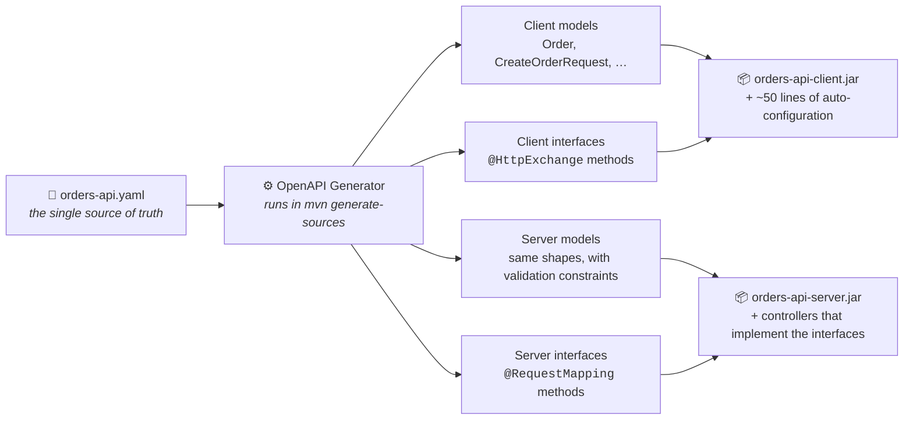
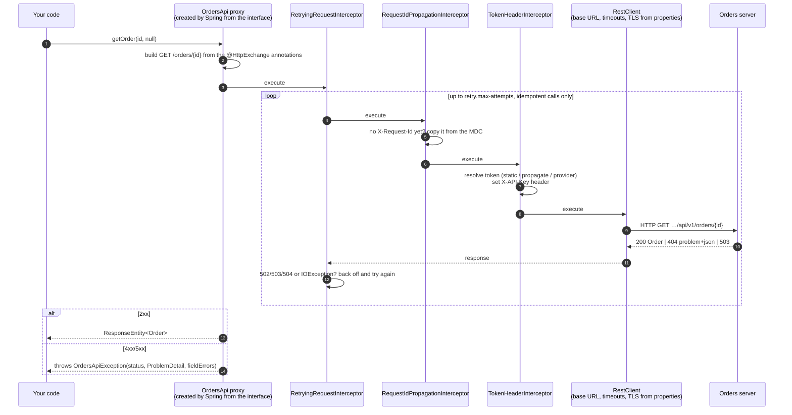
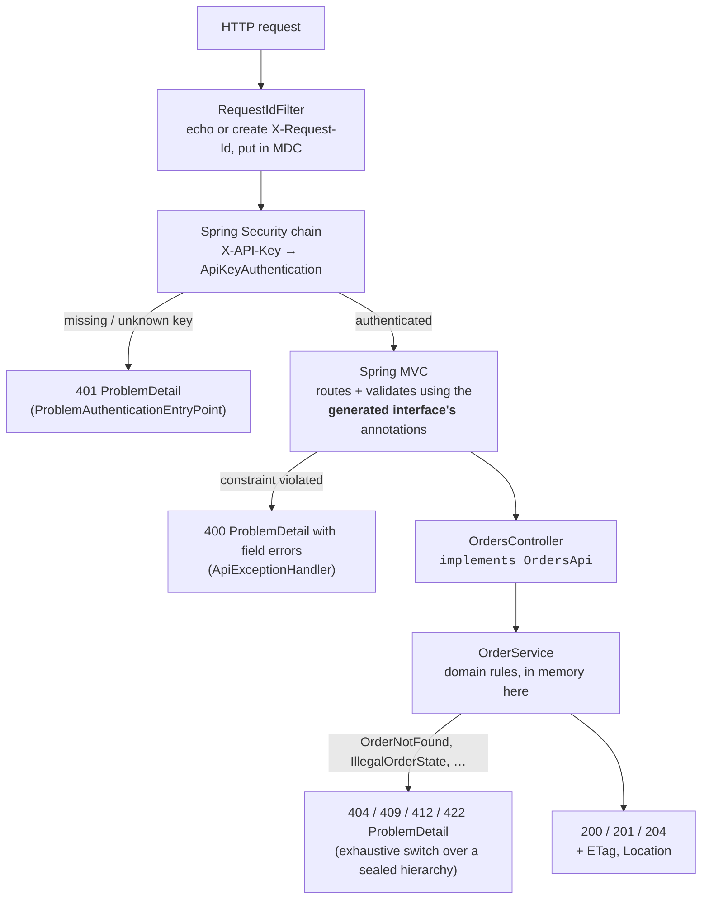
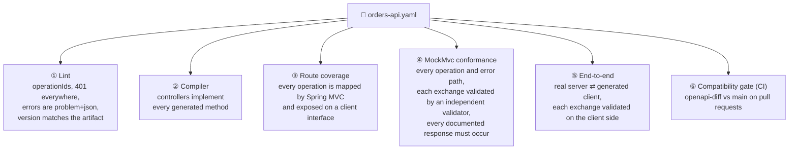
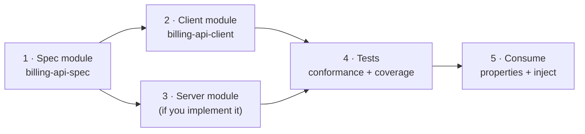
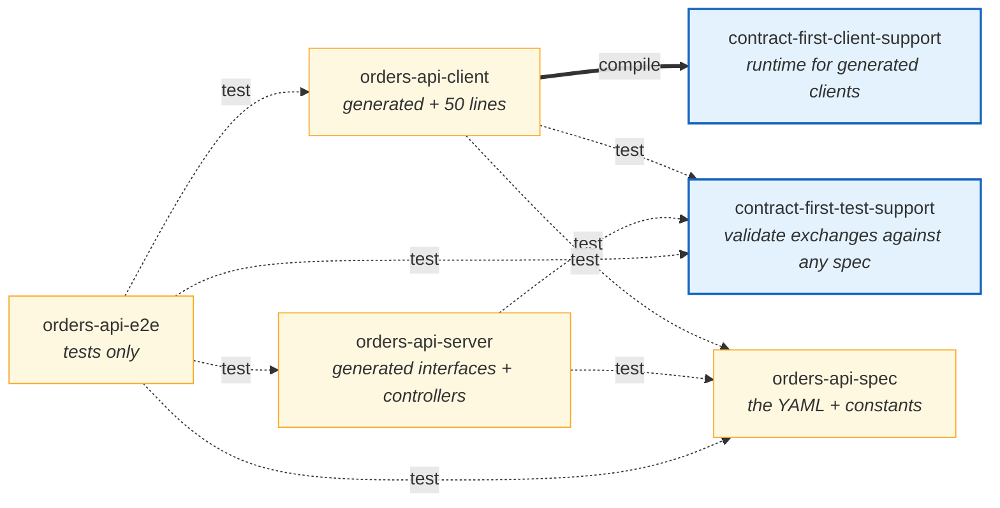
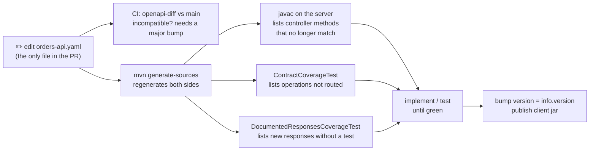

# contract-first-spring

[](https://github.com/dmitrykislov/contract-first-spring/actions/workflows/ci.yml)
[](LICENSE)
 

**Write the OpenAPI document once. Get the Java models, a Spring Boot client that is configured purely by
properties, the server interfaces your controllers must implement, and tests that prove both sides follow the
contract. Then do it again for the next API in an afternoon.**

This repository contains:

| | What | Why you care |
|---|------|--------------|
| 🧱 | **Two small libraries** you add as dependencies: `contract-first-client-support` (runtime for generated clients: authentication, retries, correlation ids, error mapping) and `contract-first-test-support` (validate any HTTP exchange against any OpenAPI document) | Everything that is not specific to one API lives here, so onboarding a new spec is configuration, not code |
| 📦 | **A complete worked example**, the *Orders API*: spec, generated client, server, and three layers of tests | Copy it when you onboard your own spec |
| 📖 | **A step-by-step guide** for a new spec ([section 6](#6-onboarding-a-new-openapi-spec-step-by-step)) and an [authentication cookbook](docs/authentication.md) | The procedure is the product |

```bash
git clone https://github.com/dmitrykislov/contract-first-spring.git && cd contract-first-spring
mvn verify                       # generates code, compiles, runs 139 tests; every HTTP exchange is checked against the spec
java -jar orders-api-server/target/orders-api-server-1.0.0-SNAPSHOT-exec.jar
curl -s -H 'X-API-Key: dev-api-key-1' localhost:8080/api/v1/catalog/products/WIDGET-BLUE-L
```

## Contents

1. [Why contract-first](#1-why-contract-first)
2. [How it works at build time: one YAML, four outputs](#2-how-it-works-at-build-time-one-yaml-four-outputs)
3. [How it works at runtime: the client](#3-how-it-works-at-runtime-the-client)
4. [How it works at runtime: the server](#4-how-it-works-at-runtime-the-server)
5. [How we know both sides follow the spec](#5-how-we-know-both-sides-follow-the-spec)
6. [Onboarding a new OpenAPI spec, step by step](#6-onboarding-a-new-openapi-spec-step-by-step)
7. [Modules and dependencies](#7-modules-and-dependencies)
8. [Configuration reference](#8-configuration-reference)
9. [Day two: when the spec changes](#9-day-two-when-the-spec-changes)
10. [Build and run](#10-build-and-run)
11. [Libraries used and why](#11-libraries-used-and-why)
12. [Defects the conformance tests caught](#12-defects-the-conformance-tests-caught)

---

## 1. Why contract-first

A REST API normally exists three times: as documentation, as a server, and as a client inside every consumer. All
three are written by hand, and they drift apart. The server adds a field the documentation never mentions. A client
sends `null` where the schema says "optional but never null". An error path returns an HTML page where
`application/problem+json` was promised. Nothing fails until a consumer breaks in production.

Contract-first turns this around. The OpenAPI document is the **only** hand-written description of the API, and the
build derives everything else from it:

| You write once | The build derives, every time |
|----------------|-------------------------------|
| the YAML | models, client interfaces, server interfaces |
| the business logic inside controllers | the routes, parameter binding and validation around it |
| conformance tests | pass or fail against the spec, not against what someone remembered |

The payoff is concrete. While this repository was being built, the conformance tests found six real defects in code
that "worked" ([section 12](#12-defects-the-conformance-tests-caught)).

## 2. How it works at build time: one YAML, four outputs



**How to read it.** Every `mvn` build parses the YAML and renders four sets of Java sources into `target/` (never
committed). The two left outputs become the client jar that consumers depend on; the two right outputs become the
server. Client and server get their *own* copies of the models, in different packages, because they are separate
deployables that release on their own schedules.

What one operation looks like at each stage:

<table>
<tr><th>In the YAML</th><th>Generated client interface</th><th>Generated server interface</th></tr>
<tr><td>

```yaml
/orders/{orderId}:
  get:
    tags: [orders]
    operationId: getOrder
    parameters:
      - $ref: '#/components/parameters/OrderId'
      - $ref: '#/components/parameters/RequestId'
    responses:
      '200': { … schema: Order }
      '404': { $ref: '…/NotFound' }
```
</td><td>

```java
public interface OrdersApi {
  @HttpExchange(method = "GET",
      value = "/orders/{orderId}",
      accept = {"application/json",
                "application/problem+json"})
  ResponseEntity<Order> getOrder(
      @PathVariable("orderId") UUID orderId,
      @RequestHeader(value = "X-Request-Id",
                     required = false)
      @Nullable UUID xRequestId);
}
```
</td><td>

```java
@RequestMapping("${openapi.orders.base-path:/api/v1}")
public interface OrdersApi {
  @RequestMapping(method = GET,
      value = "/orders/{orderId}",
      produces = {"application/json",
                  "application/problem+json"})
  ResponseEntity<Order> getOrder(
      @PathVariable("orderId") UUID orderId,
      @RequestHeader(value = "X-Request-Id",
                     required = false)
      @Nullable UUID xRequestId);
}
```
</td></tr>
</table>

The mapping is mechanical and complete: `tags` → one interface per tag, `operationId` → method name, `in: path` →
`@PathVariable`, `in: query` → `@RequestParam`, `in: header` → `@RequestHeader`, `requestBody` → `@RequestBody`,
response media types → `accept`/`produces`, `format: uuid` → `UUID`, `format: date-time` → `OffsetDateTime`,
`required: false` → `@Nullable`, `nullable: true` → `JsonNullable<T>`. The server variant additionally carries the
schema's constraints (`@NotNull`, `@Size`, `@Pattern`, `@Valid`) so Spring MVC validates before your code runs.

Neither interface has a single method body. The client interface says *what* to send and Spring supplies *how*; the
server interface says *what* to accept and your controller supplies the logic.

## 3. How it works at runtime: the client

An application that depends on `orders-api-client` injects the generated `OrdersApi` and calls it. This is what
happens on `orders.getOrder(id, null)`:



**How to read it.**

1. **The proxy** is created by Spring Framework's HTTP service support from the generated interface. Nobody writes
   it. `OrdersClientAutoConfiguration` registers all generated interfaces in an *HTTP service group* named `orders`
   with one annotation, `@ImportHttpServices(group = "orders", basePackageClasses = OrdersApi.class)`.
2. **The `RestClient` underneath** is built by Spring Boot from `spring.http.serviceclient.orders.*`: base URL,
   connect and read timeouts, redirects, default headers, TLS bundle. The client jar contains none of these values.
3. **The three interceptors** come from `contract-first-client-support` and are configured by
   `orders.client.retry.*`, `orders.client.request-id.*` and `orders.client.auth.*`. Retry is outermost so every
   attempt resolves the token again (useful after a key rotation) and keeps the correlation id.
4. **Errors are typed.** Any 4xx/5xx becomes `OrdersApiException` carrying Spring's `ProblemDetail`
   (RFC 9457) and, for validation failures, a typed list of field errors. Non-problem bodies (a proxy's HTML page) are
   kept only as a short excerpt.
5. **JSON is contract-safe.** Unset optional fields are omitted, never sent as `null`; `nullable: true` properties
   use `JsonNullable` so "absent", "null" and "value" stay distinct. This holds regardless of the application's own
   Jackson settings.

In code, the whole client module's hand-written part is this (plus a properties record and two one-line types):

```java
@AutoConfiguration(before = HttpServiceClientAutoConfiguration.class)
@EnableConfigurationProperties(OrdersClientProperties.class)
@ImportHttpServices(group = "orders", basePackageClasses = OrdersApi.class)
public class OrdersClientAutoConfiguration {

    @Bean @ConditionalOnMissingBean
    OrdersTokenProvider ordersTokenProvider(OrdersClientProperties p) {
        return ContractClientSupport.tokenProvider(p.auth(), OrdersTokenProvider.class)::token;
    }

    @Bean @Order(Ordered.LOWEST_PRECEDENCE - 100)
    RestClientHttpServiceGroupConfigurer ordersClientGroupConfigurer(OrdersClientProperties p, OrdersTokenProvider tokens, JsonMapper json) {
        return ContractClientSupport.forGroup("orders")
                .auth(p.auth(), tokens).retry(p.retry()).requestId(p.requestId())
                .jsonMapper(json).exceptions(OrdersApiException::new)
                .groupConfigurer();
    }
}
```

## 4. How it works at runtime: the server



**How to read it.**

1. **Routing and validation are inherited.** `OrdersController implements OrdersApi` and carries no mapping or
   validation annotations of its own; they come from the generated interface. Spring MVC rejects a bad UUID, a
   too-short `Idempotency-Key` or a negative quantity before the controller method runs.
2. **The compiler enforces completeness.** The interface is generated without default methods, so a controller that
   forgets an operation does not compile, and a spec change that alters a signature produces a `javac` error at the
   exact method.
3. **Security is Spring Security**, not a hand-rolled filter: a stateless chain on the API base path, an
   `AuthenticationFilter` that converts the `X-API-Key` header, a constant-time `ApiKeyAuthenticationManager`, and an
   entry point that renders 401 as a `ProblemDetail`. No sessions, CSRF, Basic challenge or generated default user.
4. **Every failure is a `ProblemDetail`.** `ApiExceptionHandler` extends `ResponseEntityExceptionHandler`, so
   framework exceptions keep Spring's status mapping; each response is decorated with the API's `type` namespace and an
   absolute `instance`; domain failures map through a pattern-matching `switch` that the compiler keeps exhaustive.
5. **The domain is plain Java.** `OrderService`, `OrderDraft`, `StoredOrder` and `Change<T>` (keep/set/clear for
   JSON Merge Patch) know nothing about HTTP; `OrderMapper` translates at the boundary.

## 5. How we know both sides follow the spec



| # | What it catches | Where |
|---|-----------------|-------|
| ① | a broken or mis-versioned contract, before any code exists | `OrdersApiSpecTest` |
| ② | a missing or mistyped operation | `javac` |
| ③ | an operation that compiles but is not routed, or not on the client | `ContractCoverageTest`, `ClientContractCoverageTest` |
| ④ | wrong status, missing header, wrong media type, body not matching the schema, undeclared responses, **and documented responses nobody tests** | `*ConformanceTest`, `DocumentedResponsesCoverageTest` |
| ⑤ | client-side encoding, serialisation policy, auto-configuration wiring, token modes, correlation ids | `OrdersEndToEndIT` (Failsafe) |
| ⑥ | an incompatible spec change without a major version bump | CI job `contract-compatibility` |

Check ④ is the heart of it. A test that asserts `status 404` proves what the developer expected; the validator
(Atlassian's `openapi-request-validator`, fed the same YAML) proves what the **contract** expects, for the whole
response. `DocumentedResponsesCoverageTest` runs last and fails if any documented response of any operation was never
produced during the suite: today that is 8 operations and 38 responses, all exercised.

The suite was checked by mutation. Eleven defects were injected one at a time (201 turned into 200, field errors
dropped, a controller left unregistered, nulls serialised on either side, idempotent replay removed, the API-key check
disabled, PATCH ignoring a field, a response code removed from the spec, the token sent on the wrong header, problems
left undecoded). Every one failed the build.

## 6. Onboarding a new OpenAPI spec, step by step

Suppose another team publishes `billing-api.yaml`, mounted at `/billing/v1`, secured by `Authorization: Bearer …`.
Here is the whole procedure. Each step names the Orders file to copy from.



### Step 1. Package the spec (copy `orders-api-spec`)

```
billing-api-spec/
├── pom.xml                                   ← copy; artifactId billing-api-spec
└── src/main/
    ├── resources/openapi/billing-api.yaml    ← the document you received
    ├── resources-filtered/contract.properties← copy unchanged
    └── java/…/billing/spec/BillingContract.java
```

```java
public final class BillingContract {
    public static final String RESOURCE = "openapi/billing-api.yaml";
    public static final String BASE_PATH = "/billing/v1";     // the path part of servers[0].url
    public static final String CLIENT_GROUP = "billing";
}
```

Copy `OrdersApiSpecTest` as `BillingApiSpecTest` and point it at the new resource. It will tell you immediately if
the spec lacks operationIds, documents errors as something other than `problem+json`, or has a version that does not
match your artifact version. Fix the spec or relax the rule; both are legitimate, but decide consciously.

### Step 2. Generate and publish the client (copy `orders-api-client`)

Add the generator execution to the module's `pom.xml`, changing only the packages:

```xml
<plugin>
  <groupId>org.openapitools</groupId>
  <artifactId>openapi-generator-maven-plugin</artifactId>
  <executions>
    <execution>
      <id>generate-billing-client</id>
      <goals><goal>generate</goal></goals>
      <configuration>
        <inputSpec>${project.basedir}/../billing-api-spec/src/main/resources/openapi/billing-api.yaml</inputSpec>
        <library>spring-http-interface</library>
        <apiPackage>com.acme.billing.client.api</apiPackage>
        <modelPackage>com.acme.billing.client.model</modelPackage>
        <configOptions>
          <useBeanValidation>false</useBeanValidation>
          <useSpringBuiltInValidation>false</useSpringBuiltInValidation>
        </configOptions>
      </configuration>
    </execution>
  </executions>
</plugin>
```

(The shared options, `useSpringBoot4`, `useJackson3`, `useJspecify`, `useTags`, `openApiNullable`,
`containerDefaultToNull`, `generateBuilders`, come from the root POM's `pluginManagement`; keep that block.)

Then write four small files. They are the *entire* hand-written content of a client module:

```java
// 1. Properties: your prefix, the shared blocks
@ConfigurationProperties("billing.client")
public record BillingClientProperties(@DefaultValue("true") boolean enabled,
        @DefaultValue AuthProperties auth, @DefaultValue RetryProperties retry, @DefaultValue RequestIdProperties requestId) {}

// 2. A marker type, so an app with several clients can have one token bean per API
@FunctionalInterface
public interface BillingTokenProvider extends TokenProvider {}

// 3. A typed exception, so callers can catch this API's failures
public class BillingApiException extends ApiException {
    public BillingApiException(HttpStatusCode s, @Nullable ProblemDetail p, List<ApiFieldError> e, @Nullable String raw) { super(s, p, e, raw); }
}

// 4. The auto-configuration: identical to Orders apart from names
@AutoConfiguration(before = HttpServiceClientAutoConfiguration.class)
@ConditionalOnProperty(prefix = "billing.client", name = "enabled", havingValue = "true", matchIfMissing = true)
@EnableConfigurationProperties(BillingClientProperties.class)
@ImportHttpServices(group = "billing", basePackageClasses = InvoicesApi.class)   // any generated interface
public class BillingClientAutoConfiguration {
    @Bean @ConditionalOnMissingBean
    BillingTokenProvider billingTokenProvider(BillingClientProperties p) {
        return ContractClientSupport.tokenProvider(p.auth(), BillingTokenProvider.class)::token;
    }
    @Bean @Order(Ordered.LOWEST_PRECEDENCE - 100)
    RestClientHttpServiceGroupConfigurer billingClientGroupConfigurer(BillingClientProperties p, BillingTokenProvider t, JsonMapper json) {
        return ContractClientSupport.forGroup("billing").auth(p.auth(), t).retry(p.retry()).requestId(p.requestId())
                .jsonMapper(json).exceptions(BillingApiException::new).groupConfigurer();
    }
}
```

Register it in `src/main/resources/META-INF/spring/org.springframework.boot.autoconfigure.AutoConfiguration.imports`
(one line, the class name). Dependencies: `contract-first-client-support`, `jakarta.validation-api`,
`jakarta.annotation-api`. Build, and `mvn -pl billing-api-client -am install` publishes the jar.

### Step 3. Implement the server (copy `orders-api-server`), if the API is yours

Copy the server generator execution (`library=spring-boot`, `interfaceOnly`, `skipDefaultInterface`,
`requestMappingMode=api_interface`), set your packages, build once, and implement the generated interfaces:

```java
@RestController
public class InvoicesController implements InvoicesApi {   // the compiler now lists every operation you must write
    ...
}
```

Keep `ApiExceptionHandler`, `ProblemFactory` and `JsonConfig` as they are (they are contract-agnostic). Keep the
`security` package if the scheme is an API key; for OAuth2 bearer tokens replace the chain with Spring Security's
resource-server support and keep `ProblemAuthenticationEntryPoint`. Set `openapi.billing.base-path` in
`application.yaml` to the same value as `BillingContract.BASE_PATH`.

### Step 4. Prove conformance (copy the test classes)

Add `contract-first-test-support` and `billing-api-spec` at test scope. In the server module:

```java
public abstract class ApiTestBase {
    protected static final Contract CONTRACT = Contract.fromClasspath(BillingContract.RESOURCE, BillingContract.BASE_PATH);
    protected static void assertExchangeConforms(MvcTestResult r) { CONTRACT.mockMvc().assertExchangeConforms(r); }
    protected static void assertResponseConforms(MvcTestResult r) { CONTRACT.mockMvc().assertResponseConforms(r); }
}
```

Write one MockMvc test per operation and per error path, calling `assertExchangeConforms` (or
`assertResponseConforms` when the request is deliberately invalid). Copy `ContractCoverageTest`,
`DocumentedResponsesCoverageTest` and `junit-platform.properties` unchanged except for the constants: the first fails
until every operation is routed, the second fails until every documented response has been produced by some test.
In the client module copy `ClientContractCoverageTest`. For end-to-end, copy `orders-api-e2e`: the consumer
application adds `CONTRACT.validatingInterceptor()` to the group and every real exchange is validated.

### Step 5. Consume it

```yaml
spring.http.serviceclient.billing.base-url: https://billing.example.com/billing/v1
spring.http.serviceclient.billing.connect-timeout: 2s
spring.http.serviceclient.billing.read-timeout: 5s
billing.client.auth.mode: static
billing.client.auth.header-name: Authorization
billing.client.auth.scheme: Bearer
billing.client.auth.token: ${BILLING_TOKEN}
```

```java
@Service
class Finance {
    private final InvoicesApi invoices;                 // generated, injected, done
    Finance(InvoicesApi invoices) { this.invoices = invoices; }
}
```

Other token modes (forwarding the caller's token, fetching from an identity provider, caching, retry on 401) are in
[docs/authentication.md](docs/authentication.md).

## 7. Modules and dependencies



Dependencies point to the right. Blue boxes are the two reusable libraries you add to your own projects; yellow
boxes are the Orders example. The thick arrow is the only compile-scope dependency between modules: a consumer's
classpath gets the client plus `contract-first-client-support`, nothing else from here. Every dotted arrow is test
scope. Note what is *absent*: the client never depends on the server or the spec jar at compile time, and the server
never depends on the client.

| Module | Contains | Who depends on it | Why it exists separately |
|--------|----------|-------------------|--------------------------|
| **contract-first-client-support** | `ContractClientSupport`, token providers (`Static`, `Propagating`, `Caching`), `TokenContext`, the three interceptors, `ProblemResponseErrorHandler`, `ApiException`, the three properties records | every client module, at compile scope | Fix a bug in retries or token handling once, for every API |
| **contract-first-test-support** | `Contract`, `MockMvcContract`, `ContractValidatingInterceptor`, `ContractOperation`, `ContractCoverage` | server tests, e2e tests, client coverage test, at test scope | Keeps validator dependencies out of production jars; one implementation of the MockMvc and RestClient adapters |
| **orders-api-spec** | the YAML, `OrdersContract` constants, filtered `contract.properties` | tests of client, server and e2e | The contract must be loadable from the classpath wherever it is validated, and its version must be checkable |
| **orders-api-client** | generated models and interfaces, `OrdersClientProperties`, `OrdersClientAutoConfiguration`, `OrdersTokenProvider`, `OrdersApiException` | consuming applications | The one artifact consumers see |
| **orders-api-server** | generated interfaces and models, controllers, domain, Spring Security, problem handling | `orders-api-e2e` (tests only) | A separate deployable; its plain jar is the main artifact and the runnable fat jar is attached as `-exec` |
| **orders-api-e2e** | `OrdersEndToEndIT` and three small consumer applications | nobody | The only place client and server meet; runs under Failsafe so `mvn test` stays fast |

Reactor order: client-support → test-support → spec → client → server → e2e.

## 8. Configuration reference

Everything below is a property; the client jar contains no environment-specific values.

**Owned by Spring Boot** (`spring.http.serviceclient.<group>.*`, group `orders` here):

| Property | Meaning |
|----------|---------|
| `base-url` | where the API lives, including the base path, e.g. `https://orders.example.com/api/v1` |
| `connect-timeout`, `read-timeout` | durations, e.g. `2s` |
| `redirects` | `follow` or `dont-follow` |
| `default-header.<name>` | headers added to every call |
| `ssl.bundle` | an `spring.ssl.bundle.*` name for mTLS or custom trust |

**Owned by the client module** (`orders.client.*`, blocks from `contract-first-client-support`):

| Property | Default | Meaning |
|----------|---------|---------|
| `enabled` | `true` | register the client beans at all |
| `auth.mode` | `static` | `static`: send `auth.token`. `propagate`: forward the caller's token from `TokenContext` or the current servlet request. `provider`: ask your `OrdersTokenProvider` bean on every call |
| `auth.header-name` | `X-API-Key` | header carrying the token |
| `auth.scheme` | *(none)* | e.g. `Bearer`, inserted before the token; stripped from forwarded headers so it is never doubled |
| `auth.token` | | the token, `static` mode only |
| `retry.enabled` | `true` | retry idempotent calls: GET, HEAD, OPTIONS, PUT, DELETE always; POST and PATCH only with an `Idempotency-Key` header |
| `retry.max-attempts` | `3` | total attempts; `1` disables |
| `retry.initial-backoff`, `retry.multiplier`, `retry.max-backoff` | `200ms`, `2.0`, `2s` | exponential backoff |
| `retry.retryable-statuses` | `502,503,504` | statuses treated as transient; `IOException` is always retried |
| `request-id.enabled` | `true` | copy the MDC request id onto outgoing calls when the caller did not set one |
| `request-id.header-name`, `request-id.mdc-key` | `X-Request-Id`, `requestId` | |

If no token can be resolved, or the provider throws, the call fails before anything is sent with
`ClientAuthenticationException` that names the mode and the fix.

## 9. Day two: when the spec changes



A pull request that changes the contract contains the YAML and nothing else generated. The compatibility job
compares it with `main`; a removed field or response fails the job unless `info.version` moved to a new major. After
regeneration the compiler, the route coverage test and the response coverage test each produce a precise list of
what still has to be done. Consumers upgrade by bumping the client jar version, which always equals the contract
version (a lint test enforces this).

## 10. Build and run

```bash
mvn verify                                 # generate, compile, unit + MockMvc tests (Surefire), end-to-end (Failsafe)
mvn test                                   # same without the end-to-end suite
mvn generate-sources                       # only regenerate; look in */target/generated-sources/openapi
mvn -pl orders-api-client -am install      # install the client jar locally
java -jar orders-api-server/target/orders-api-server-1.0.0-SNAPSHOT-exec.jar
```

Requirements: Java 25 and Maven 3.9 or later (enforced). The first build downloads Spring Boot 4.1.1 and OpenAPI
Generator 7.26.0, about 40 MB. JaCoCo reports land in `*/target/site/jacoco`. Dependabot and CodeQL are configured
under `.github/`. Generated sources live under `target/` and are never committed.

The sample uses `example.com` hosts and demo API keys in `application.yaml`; the `io.github.dmitrykislov`
coordinates are the only repository-specific detail.

## 11. Libraries used and why

| Need | Choice | Why this one |
|------|--------|--------------|
| Generate from OpenAPI | **OpenAPI Generator 7.26** (`spring` generator, stock templates) | Native options for Spring Boot 4, Jackson 3 and JSpecify; `spring-http-interface` for `@HttpExchange` clients, `interfaceOnly` for servers. No fork, no custom templates, so upgrades are a version bump |
| Declarative client runtime | **Spring Framework 7 HTTP service clients** + **Spring Boot 4.1** groups | Base URL, timeouts, TLS and headers are Boot properties. OpenFeign is in maintenance mode and adds nothing |
| Validate exchanges against the spec | **Atlassian `openapi-request-validator` 3.0** (core) | Framework-agnostic; its own Spring interceptor validates percent-encoded query values, hence the small adapter in test-support |
| Server authentication | **Spring Security 7.1** | Standard filter chain, `ProblemDetail` entry point, default user backs off when an `AuthenticationManager` bean exists |
| Spec compatibility | **openapi-diff 2.1** | Runs in CI on pull requests |
| Nullable properties | **jackson-databind-nullable 0.2.12** | Ships the Jackson 3 module for `JsonNullable` |
| Spec parsing | **swagger-parser 2.1** | |

Not used: Spring Cloud Contract (its own DSL), springdoc-openapi (code-first, the opposite direction), hand-written
client wrappers (they duplicate the contract).

## 12. Defects the conformance tests caught

All fixed; listed because they are exactly what this setup exists to find.

* Four operations could return `400` (malformed UUID or SKU pattern) without the spec declaring it; PUT could return
  `422` for an unknown SKU without declaring it.
* `Problem.instance` was a path where the schema requires an absolute `uri`.
* A test `application.yaml` in the e2e module shadowed the server's and switched off `NON_NULL` inclusion,
  producing `"errors": null`. JSON policy now lives in code.
* The client sent `"notes": null` for unset optional fields; it now pins its own serialisation policy.
* `OffsetDateTime` query values were formatted in a way the server tolerated but RFC 3339 does not require servers to
  accept; the client-side validator flagged it.
* The response-coverage test, added last, found four documented responses that no test had ever produced.

## License

Apache License 2.0, see [LICENSE](LICENSE).
