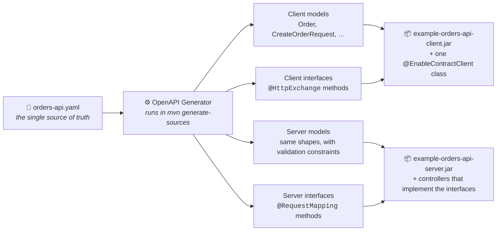
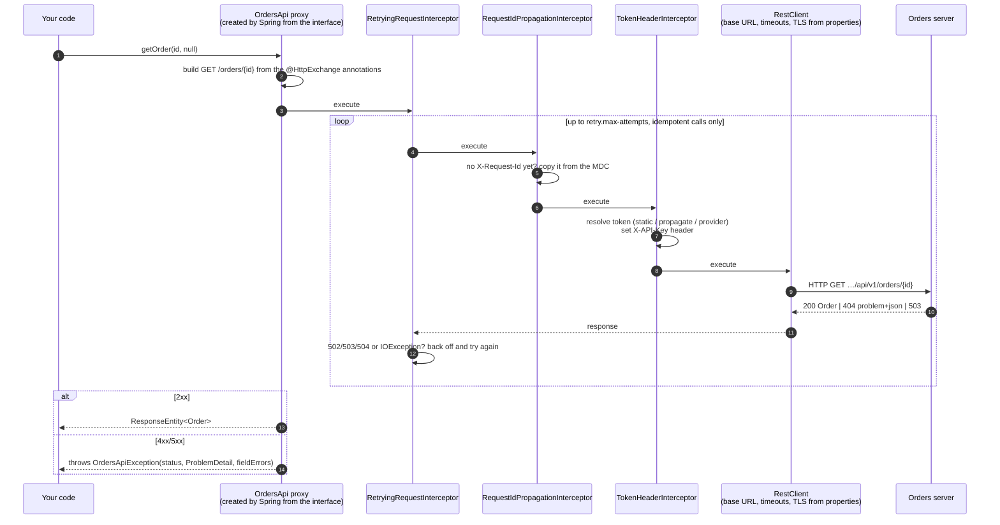
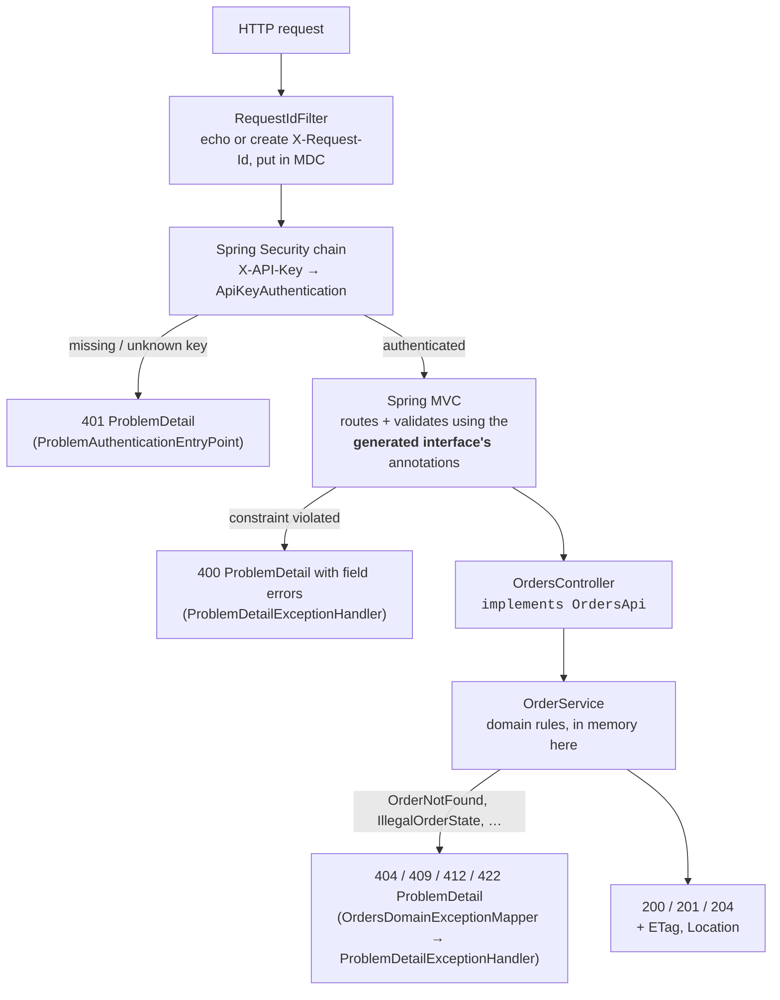
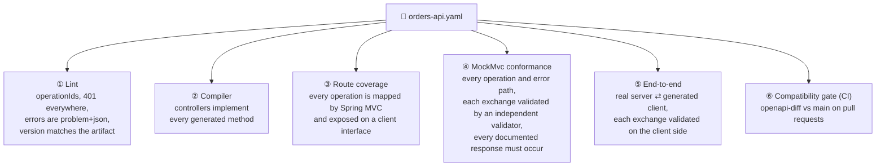
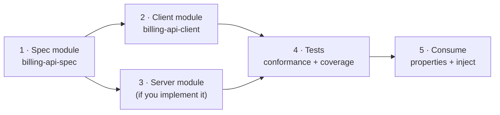
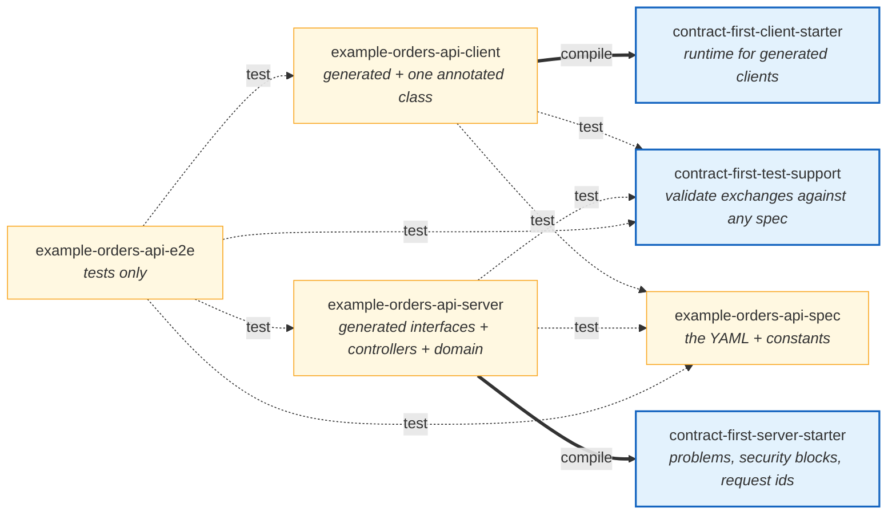
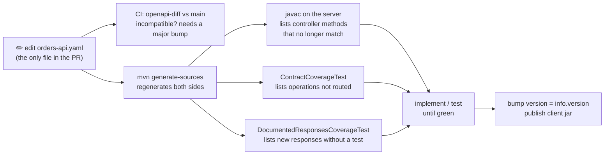

# contract-first-spring

[](https://github.com/dmitrykislov/contract-first-spring/actions/workflows/ci.yml)
[](LICENSE)
 

**Write the OpenAPI document once. Get the Java models, a Spring Boot client that is configured purely by
properties, the server interfaces your controllers must implement, and tests that prove both sides follow the
contract. Then do it again for the next API in an afternoon.**

This repository contains:

| | What | Why you care |
|---|------|--------------|
| 🧱 | **Three libraries under `libs/`, the things you depend on**: `contract-first-client-starter` (one annotation turns generated interfaces into configured clients: authentication, retries, correlation ids, error mapping), `contract-first-server-starter` (problem rendering, domain-error mapping, correlation ids, API-key security blocks) and `contract-first-test-support` (validate any HTTP exchange against any OpenAPI document, reusable coverage tests) | Everything that is not specific to one API lives here, so onboarding a new spec is one annotated class on the client, one exception mapper on the server, and three-line test subclasses |
| 📦 | **One worked example under `examples/orders-api/`, the thing you copy**: spec, generated client, server, and three layers of tests, published as `example-orders-api-*` so it can never be mistaken for a library | Copy it when you onboard your own spec; never depend on it |
| 📖 | **A step-by-step guide** for onboarding a new spec ([section 6](#6-onboarding-a-new-openapi-spec-step-by-step)) and an [authentication cookbook](docs/authentication.md) | The procedure is repeatable: a new API is configuration plus a few small files |

```
contract-first-spring/
├── libs/                                 ← reusable: add these to your own projects
│   ├── contract-first-client-starter     ← compile scope in every client jar you publish
│   ├── contract-first-server-starter     ← compile scope in every service that implements a contract
│   └── contract-first-test-support       ← test scope wherever exchanges are checked against a spec
└── examples/orders-api/                  ← the worked example: copy from it, never depend on it
    ├── spec/     → example-orders-api-spec      the YAML as a jar
    ├── client/   → example-orders-api-client    generated client + one annotated class
    ├── server/   → example-orders-api-server    generated interfaces + controllers + domain
    └── e2e/      → example-orders-api-e2e       server ⇄ client over real HTTP
```

```bash
git clone https://github.com/dmitrykislov/contract-first-spring.git && cd contract-first-spring
mvn verify                       # generates code, compiles, runs 162 tests; every HTTP exchange is checked against the spec
java -jar examples/orders-api/server/target/example-orders-api-server-1.0.0-SNAPSHOT-exec.jar
curl -s -H 'X-API-Key: dev-api-key-1' localhost:8080/api/v1/catalog/products/WIDGET-BLUE-L
```

## Contents

1. [Why contract-first](#1-why-contract-first)
2. [How it works at build time: one YAML, four outputs](#2-how-it-works-at-build-time-one-yaml-four-outputs)
3. [How it works at runtime: the client](#3-how-it-works-at-runtime-the-client)
4. [How it works at runtime: the server](#4-how-it-works-at-runtime-the-server)
5. [How we know both sides follow the spec](#5-how-we-know-both-sides-follow-the-spec)
6. [Onboarding a new OpenAPI spec, step by step](#6-onboarding-a-new-openapi-spec-step-by-step)
7. [Modules and dependencies](#7-modules-and-dependencies)
8. [Configuration reference](#8-configuration-reference)
9. [Day two: when the spec changes](#9-day-two-when-the-spec-changes)
10. [Build and run](#10-build-and-run)
11. [Libraries used and why](#11-libraries-used-and-why)

---

## 1. Why contract-first

A REST API normally exists three times: as documentation, as a server, and as a client inside every consumer. All
three are written by hand, and they drift apart. The server adds a field the documentation never mentions. A client
sends `null` where the schema says "optional but never null". An error path returns an HTML page where
`application/problem+json` was promised. Nothing fails until a consumer breaks in production.

Contract-first turns this around. The OpenAPI document is the **only** hand-written description of the API, and the
build derives everything else from it:

| You write once | The build derives, every time |
|----------------|-------------------------------|
| the YAML | models, client interfaces, server interfaces |
| the business logic inside controllers | the routes, parameter binding and validation around it |
| conformance tests | pass or fail against the spec, not against what someone remembered |

The payoff: a wrong status code, a missing header, a `null` where the schema forbids it, or an undocumented response
is a failed build, not a production incident.

## 2. How it works at build time: one YAML, four outputs



**How to read it.** Every `mvn` build parses the YAML and renders four sets of Java sources into `target/` (never
committed). The two left outputs become the client jar that consumers depend on; the two right outputs become the
server. Client and server get their *own* copies of the models, in different packages, because they are separate
deployables that release on their own schedules.

What one operation looks like at each stage:

<table>
<tr><th>In the YAML</th><th>Generated client interface</th><th>Generated server interface</th></tr>
<tr><td>

```yaml
/orders/{orderId}:
  get:
    tags: [orders]
    operationId: getOrder
    parameters:
      - $ref: '#/components/parameters/OrderId'
      - $ref: '#/components/parameters/RequestId'
    responses:
      '200': { … schema: Order }
      '404': { $ref: '…/NotFound' }
```
</td><td>

```java
public interface OrdersApi {
  @HttpExchange(method = "GET",
      value = "/orders/{orderId}",
      accept = {"application/json",
                "application/problem+json"})
  ResponseEntity<Order> getOrder(
      @PathVariable("orderId") UUID orderId,
      @RequestHeader(value = "X-Request-Id",
                     required = false)
      @Nullable UUID xRequestId);
}
```
</td><td>

```java
@RequestMapping("${openapi.orders.base-path:/api/v1}")
public interface OrdersApi {
  @RequestMapping(method = GET,
      value = "/orders/{orderId}",
      produces = {"application/json",
                  "application/problem+json"})
  ResponseEntity<Order> getOrder(
      @PathVariable("orderId") UUID orderId,
      @RequestHeader(value = "X-Request-Id",
                     required = false)
      @Nullable UUID xRequestId);
}
```
</td></tr>
</table>

The mapping is mechanical and complete: `tags` → one interface per tag, `operationId` → method name, `in: path` →
`@PathVariable`, `in: query` → `@RequestParam`, `in: header` → `@RequestHeader`, `requestBody` → `@RequestBody`,
response media types → `accept`/`produces`, `format: uuid` → `UUID`, `format: date-time` → `OffsetDateTime`,
`required: false` → `@Nullable`, `nullable: true` → `JsonNullable<T>`. The server variant additionally carries the
schema's constraints (`@NotNull`, `@Size`, `@Pattern`, `@Valid`) so Spring MVC validates before your code runs.

Neither interface has a single method body. The client interface says *what* to send and Spring supplies *how*; the
server interface says *what* to accept and your controller supplies the logic.

## 3. How it works at runtime: the client

An application that depends on `example-orders-api-client` injects the generated `OrdersApi` and calls it. This is what
happens on `orders.getOrder(id, null)`:



**How to read it.**

1. **The proxy** is created by Spring Framework's HTTP service support from the generated interface. Nobody writes
   it. The client jar's hand-written entry point, `OrdersClient`, carries `@EnableContractClient(group = "orders",
   basePackageClasses = OrdersApi.class, …)`, which registers all generated interfaces in an *HTTP service group*
   named `orders` and wires everything below.
2. **The `RestClient` underneath** is built by Spring Boot from `spring.http.serviceclient.orders.*`: base URL,
   connect and read timeouts, redirects, default headers, TLS bundle. The client jar contains none of these values.
3. **The three interceptors** come from `contract-first-client-starter` and are configured by
   `openapi.clients.groups.orders.retry.*`, `.request-id.*` and `.auth.*`, layered over
   `openapi.clients.defaults.*`. The group key `orders` is the same one Spring Boot uses under
   `spring.http.serviceclient`, so connection and behaviour settings of one client sit side by side. Retry is outermost so every attempt resolves the token again (useful after
   a key rotation) and keeps the correlation id.
4. **Errors are typed.** Any 4xx/5xx becomes `OrdersApiException` carrying Spring's `ProblemDetail`
   (RFC 9457) and, for validation failures, a typed list of field errors. Non-problem bodies (a proxy's HTML page) are
   kept only as a short excerpt.
5. **JSON is contract-safe.** Unset optional fields are omitted, never sent as `null`; `nullable: true` properties
   use `JsonNullable` so "absent", "null" and "value" stay distinct. This holds regardless of the application's own
   Jackson settings.

In code, the whole hand-written part of the client module is this class (plus two optional one-line types, a
typed exception and a token-provider marker, and the `AutoConfiguration.imports` line that names it):

```java
@EnableContractClient(
        group = "orders",                          // key under spring.http.serviceclient and openapi.clients.groups
        basePackageClasses = OrdersApi.class,      // where the generator put the @HttpExchange interfaces
        exception = OrdersApiException.class,      // optional: a typed catch for this API's failures
        tokenProvider = OrdersTokenProvider.class) // optional: marker type for this API's token bean
public class OrdersClient {}
```

Behind the annotation, `contract-first-client-starter` registers the HTTP service group, binds the group's settings,
resolves the token provider (a bean of the marker type, else a bean named `ordersTokenProvider`, else the built-in
provider for the configured mode), applies the three interceptors and the JSON policy, and maps errors to the
exception type. A misspelt group in configuration, a missing token in `static` mode, or a missing provider bean in
`provider` mode fails startup with a message naming the group.

## 4. How it works at runtime: the server



**How to read it.**

1. **Routing and validation are inherited.** `OrdersController implements OrdersApi` and carries no mapping or
   validation annotations of its own; they come from the generated interface. Spring MVC rejects a bad UUID, a
   too-short `Idempotency-Key` or a negative quantity before the controller method runs.
2. **The compiler enforces completeness.** The interface is generated without default methods, so a controller that
   forgets an operation does not compile, and a spec change that alters a signature produces a `javac` error at the
   exact method.
3. **Security is Spring Security**, assembled from `contract-first-server-starter` building blocks that exist only
   when `openapi.server.api-key.accepted-keys` is set: an `AuthenticationFilter` converting the `X-API-Key` header, a
   constant-time `ApiKeyAuthenticationManager`, and an entry point rendering 401 as a `ProblemDetail`. The service's
   own `SecurityConfig` reduces to one statement, `apiKey.configure(http).build()`, and stays in charge of what else
   it protects.
   No sessions, CSRF, Basic challenge or generated default user.
4. **Every failure is a `ProblemDetail`**, rendered by the library's `ProblemDetailExceptionHandler`: framework exceptions
   keep Spring's status mapping, every response gets the configured `type` namespace and an absolute `instance`,
   validation failures carry field errors. The only API-specific piece is `OrdersDomainExceptionMapper`, a
   pattern-matching `switch` over the sealed domain exceptions that the compiler keeps exhaustive.
5. **JSON policy is scoped to the HTTP boundary.** Spring MVC's converters use a contract mapper (unset optional
   fields omitted, `JsonNullable` understood) derived from the application's mapper, which itself stays untouched for
   messaging, caching or logging.
6. **The domain is plain Java.** `OrderService`, `OrderDraft`, `StoredOrder` and `Change<T>` (keep/set/clear for
   JSON Merge Patch) know nothing about HTTP; `OrderMapper` translates at the boundary.

## 5. How we know both sides follow the spec



| # | What it catches | Where |
|---|-----------------|-------|
| ① | a broken or mis-versioned contract, before any code exists | `OrdersApiSpecTest` |
| ② | a missing or mistyped operation | `javac` |
| ③ | an operation that compiles but is not routed, or not on the client | `ContractCoverageTest`, `ClientContractCoverageTest` |
| ④ | wrong status, missing header, wrong media type, body not matching the schema, undeclared responses, **and documented responses nobody tests** | `*ConformanceTest`, `DocumentedResponsesCoverageTest` |
| ⑤ | client-side encoding, serialisation policy, auto-configuration wiring, token modes, correlation ids | `OrdersEndToEndIT` (Failsafe) |
| ⑥ | an incompatible spec change without a major version bump | CI job `contract-compatibility` |

Check ④ is the heart of it. A test that asserts `status 404` proves what the developer expected; the validator
(Atlassian's `openapi-request-validator`, fed the same YAML) proves what the **contract** expects, for the whole
response: status, headers, media type and body schema. `DocumentedResponsesCoverageTest` runs last and fails if any
documented response of any operation was never produced during the suite. For the Orders example that means 8
operations and 38 documented responses, every one exercised and validated on every build.

## 6. Onboarding a new OpenAPI spec, step by step

First, who adds which module. This is the whole dependency story:

| If you are… | add | scope | because |
|-------------|-----|-------|---------|
| **consuming** an API published this way | that API's client jar, e.g. `example-orders-api-client` | compile | it brings `contract-first-client-starter` transitively; set properties, inject the interface, done |
| **publishing a client** for a spec | `contract-first-client-starter` | compile | supplies `@EnableContractClient` and the whole runtime; you write one class |
| **implementing** a spec in a service | `contract-first-server-starter` | compile | problem rendering, request ids, security blocks; you write controllers and one exception mapper |
| **testing** a client or server against its spec | `contract-first-test-support` and the spec jar | test | validator adapters and the coverage base tests; the spec jar puts the YAML on the test classpath |
| anything | `example-orders-api-*` | never | they are the sample to copy from, not libraries |

Now the procedure. Suppose another team publishes `billing-api.yaml`, mounted at `/billing/v1`, secured by
`Authorization: Bearer …`. Each step names the example directory to copy from.



### Step 1. Package the spec (copy `examples/orders-api/spec`)

```
billing-api-spec/
├── pom.xml                                   ← copy; artifactId billing-api-spec
└── src/main/
    ├── resources/openapi/billing-api.yaml    ← the document you received
    ├── resources-filtered/contract.properties← copy unchanged (the copied POM filters it)
    └── java/…/billing/spec/BillingContract.java
```

```java
public final class BillingContract {
    public static final String RESOURCE = "openapi/billing-api.yaml";
    public static final String BASE_PATH = "/billing/v1";     // the path part of servers[0].url
}
```

Copy `OrdersApiSpecTest` as `BillingApiSpecTest` and point it at the new resource. It will tell you immediately if
the spec lacks operationIds, documents errors as something other than `problem+json`, or has a version that does not
match your artifact version. Fix the spec or relax the rule; both are legitimate, but decide consciously.

### Step 2. Generate and publish the client (copy `examples/orders-api/client`)

Add the generator execution to the module's `pom.xml`, changing only the packages:

```xml
<plugin>
  <groupId>org.openapitools</groupId>
  <artifactId>openapi-generator-maven-plugin</artifactId>
  <executions>
    <execution>
      <id>generate-billing-client</id>
      <goals><goal>generate</goal></goals>
      <configuration>
        <inputSpec>${project.basedir}/../billing-api-spec/src/main/resources/openapi/billing-api.yaml</inputSpec>
        <library>spring-http-interface</library>
        <apiPackage>com.acme.billing.client.api</apiPackage>
        <modelPackage>com.acme.billing.client.model</modelPackage>
        <configOptions>
          <useBeanValidation>false</useBeanValidation>
          <useSpringBuiltInValidation>false</useSpringBuiltInValidation>
        </configOptions>
      </configuration>
    </execution>
  </executions>
</plugin>
```

(The shared options, `useSpringBoot4`, `useJackson3`, `useJspecify`, `useTags`, `openApiNullable`,
`containerDefaultToNull`, `generateBuilders`, come from the root POM's `pluginManagement`; keep that block.)

Then write **one class**:

```java
@EnableContractClient(group = "billing", basePackageClasses = InvoicesApi.class)   // any generated interface
public class BillingClient {}
```

and name it in `src/main/resources/META-INF/spring/org.springframework.boot.autoconfigure.AutoConfiguration.imports`.
Dependencies: `contract-first-client-starter`, `jakarta.validation-api`, `jakarta.annotation-api`. That is the whole
module. Two optional one-liners make it nicer for callers: `BillingApiException extends ApiException` (declare the
five-argument constructor and pass `exception = BillingApiException.class`) and `BillingTokenProvider extends
TokenProvider` (pass `tokenProvider = BillingTokenProvider.class`) so applications with several clients get a typed
catch and a typed token bean. Without them, `ApiException.group()` and a bean named `billingTokenProvider` do the
same job. `mvn -pl billing-api-client -am install` publishes the jar.

### Step 3. Implement the server (copy `examples/orders-api/server`), if the API is yours

Copy the server generator execution (`library=spring-boot`, `interfaceOnly`, `skipDefaultInterface`,
`requestMappingMode=api_interface`), set your packages, depend on `contract-first-server-starter`, build once, and
implement the generated interfaces:

```java
@RestController
public class InvoicesController implements InvoicesApi {   // the compiler now lists every operation you must write
    ...
}
```

Write one `DomainExceptionMapper` bean that gives your business exceptions their statuses; the library renders
everything as `ProblemDetail`. Configure the rest:

```yaml
openapi:
  server:
    base-path: /billing/v1
    problem.type-namespace: https://billing.example.com/problems/
    api-key.accepted-keys: ${BILLING_API_KEYS}       # if the contract uses an API key
  billing:
    base-path: ${openapi.server.base-path}           # see below
```

The last key is the placeholder the generator puts on the interface's class-level `@RequestMapping`. Its name is
derived from the spec's `info.title` (`Orders API` became `openapi.orders.base-path`); read it off the generated
interface after the first build rather than guessing.

For an API key, add a `SecurityFilterChain` bean that returns `apiKey.configure(http).build()`, as
the example server's `SecurityConfig` does. For OAuth2 bearer tokens use Spring Security's resource-server support
instead and keep the library's `ProblemAuthenticationEntryPoint` for problem-shaped 401s.

### Step 4. Prove conformance (subclass the shared tests)

Add `contract-first-test-support` and `billing-api-spec` at test scope. In the server module:

```java
public abstract class ApiTestBase {
    public static final Contract CONTRACT = Contract.fromClasspath(BillingContract.RESOURCE, BillingContract.BASE_PATH);
    protected static void assertExchangeConforms(MvcTestResult r) { CONTRACT.mockMvc().assertExchangeConforms(r); }
    protected static void assertResponseConforms(MvcTestResult r) { CONTRACT.mockMvc().assertResponseConforms(r); }
}
```

Write one MockMvc test per operation and per error path, calling `assertExchangeConforms` (or
`assertResponseConforms` when the request is deliberately invalid). Then three subclasses, each a few lines, exactly
as in `examples/orders-api/server/src/test`:

| Subclass of | Proves | Needs on the subclass |
|-------------|--------|------------------------|
| `AbstractRouteCoverageTest` | every operation is routed by Spring MVC | `@SpringBootTest`, an autowired `RequestMappingHandlerMapping` |
| `AbstractUnauthenticatedRequestsTest` | every operation rejects a missing credential with a conformant problem | `@SpringBootTest`, `@AutoConfigureMockMvc`, an autowired `MockMvcTester` |
| `AbstractDocumentedResponsesCoverageTest` | every documented response was produced by some test | `@Order(Integer.MAX_VALUE)` and the copied `junit-platform.properties`, so it runs last |

In the client module subclass `AbstractClientContractCoverageTest` (no Spring context needed). For end-to-end, copy
`examples/orders-api/e2e`: the consumer application adds `CONTRACT.validatingInterceptor()` to the group and every real
exchange is validated.

### Step 5. Consume it

```yaml
spring:
  http:
    serviceclient:
      billing:                                  # connection: Spring Boot's own block, keyed by group
        base-url: https://billing.example.com/billing/v1
        connect-timeout: 2s
        read-timeout: 5s
openapi:
  clients:
    groups:
      billing:                                  # behaviour: the starter's block, same group key
        auth:
          mode: static
          header-name: Authorization
          scheme: Bearer
          token: ${BILLING_TOKEN}
```

```java
@Service
class Finance {
    private final InvoicesApi invoices;                 // generated, injected, done
    Finance(InvoicesApi invoices) { this.invoices = invoices; }
}
```

Other token modes (forwarding the caller's token, fetching from an identity provider, caching, retry on 401) are in
[docs/authentication.md](docs/authentication.md).

### Several clients in one application

Each client is one HTTP service group, and the group name is the key in both property trees. An application that
talks to Orders with an API key and to Billing on behalf of its caller, with one retry policy for both:

```yaml
spring:
  http:
    serviceclient:
      orders:
        base-url: https://orders.example.com/api/v1
        read-timeout: 5s
      billing:
        base-url: https://billing.example.com/billing/v1
        read-timeout: 10s
openapi:
  clients:
    defaults:
      retry:
        max-attempts: 4                         # both groups, unless a group overrides it
    groups:
      orders:
        auth:
          token: ${ORDERS_API_KEY}              # static mode is the default
      billing:
        auth:
          mode: propagate                       # forward the caller's bearer token
          header-name: Authorization
          scheme: Bearer
        retry:
          max-attempts: 2                       # overrides the default for billing only
```

```java
@Service
class Checkout {
    Checkout(OrdersApi orders, InvoicesApi invoices) { … }   // each generated interface is its own bean
}

@Bean OrdersTokenProvider ordersTokenProvider(…)  { … }  // per-API token beans never clash: marker types,
@Bean BillingTokenProvider billingTokenProvider(…) { … } // or bean names <group>TokenProvider
```

Two safeguards keep this honest. `openapi.clients.groups.<name>` for a name no `@EnableContractClient` registered
fails startup (a misspelt group would otherwise be silently ignored); set `openapi.clients.fail-on-unknown-group=false`
to log instead. And each client's errors come out as its own exception type when the annotation names one, or as
`ApiException` with `group()` set, so a `catch` can tell the APIs apart.

## 7. Modules and dependencies



Dependencies point to the right. Blue boxes are the three reusable libraries under `libs/`; yellow boxes are the
example under `examples/orders-api/`. Thick arrows are the only compile-scope dependencies: a consumer's classpath gets the
client plus `contract-first-client-starter`, a service gets `contract-first-server-starter`, nothing else from here.
Every dotted arrow is test scope. Note what is *absent*: the client never depends on the server or the spec jar at
compile time, and the server never depends on the client.

| Artifact (directory) | Contains | Who depends on it | Why it exists separately |
|----------------------|----------|-------------------|--------------------------|
| **contract-first-client-starter** (`libs/contract-first-client-starter`) | `@EnableContractClient`, `ContractClientsPropertyBinder` (the `openapi.clients` namespace with `groups` and `defaults`), token providers (`Static`, `Propagating`, `Caching`), `TokenContext`, the three interceptors, `ProblemResponseErrorHandler`, `ApiException` | every client module, at compile scope | Fix a bug in retries or token handling once, for every API |
| **contract-first-server-starter** (`libs/contract-first-server-starter`) | `ProblemDetailExceptionHandler` + `DomainExceptionMapper`, `ProblemFactory`, `ContractJsonMapper` scoped to MVC converters, `RequestIdFilter`, API-key security blocks (`ApiKeySecurityConfigurer`, manager, converter, entry point), `openapi.server.*` properties | every server module, at compile scope | Problem rendering and security are correct once; a service keeps only its domain mapping and its own filter chain |
| **contract-first-test-support** (`libs/contract-first-test-support`) | `Contract` (validator, operations, coverage record), `MockMvcContractAssertions`, `ContractValidatingInterceptor`, and the base tests `AbstractRouteCoverageTest`, `AbstractClientContractCoverageTest`, `AbstractDocumentedResponsesCoverageTest`, `AbstractUnauthenticatedRequestsTest` | server tests, e2e tests, client coverage test, at test scope | Keeps validator dependencies out of production jars; one implementation of the adapters and of the coverage tests |
| **example-orders-api-spec** (`examples/orders-api/spec`) | the YAML, `OrdersContract` constants, filtered `contract.properties` | tests of client, server and e2e | The contract must be loadable from the classpath wherever it is validated, and its version must be checkable |
| **example-orders-api-client** (`examples/orders-api/client`) | generated models and interfaces, `OrdersClient` (the annotation), `OrdersTokenProvider`, `OrdersApiException` | consuming applications | The one artifact consumers see |
| **example-orders-api-server** (`examples/orders-api/server`) | generated interfaces and models, controllers, domain, `OrdersDomainExceptionMapper`, a ten-line `SecurityConfig` | `example-orders-api-e2e` (tests only) | A separate deployable; its plain jar is the main artifact and the runnable fat jar is attached as `-exec` |
| **example-orders-api-e2e** (`examples/orders-api/e2e`) | `OrdersEndToEndIT` and three small consumer applications | nobody | The only place client and server meet; runs under Failsafe so `mvn test` stays fast |

Reactor order: client-starter → server-starter → test-support → spec → client → server → e2e.

## 8. Configuration reference

Everything below is a property; the client jar contains no environment-specific values.

**Owned by Spring Boot** (`spring.http.serviceclient.<group>.*`, group `orders` here):

| Property | Meaning |
|----------|---------|
| `base-url` | where the API lives, including the base path, e.g. `https://orders.example.com/api/v1` |
| `connect-timeout`, `read-timeout` | durations, e.g. `2s` |
| `redirects` | `follow` or `dont-follow` |
| `default-header.<name>` | headers added to every call |
| `ssl.bundle` | a `spring.ssl.bundle.*` name for mTLS or custom trust |

**Owned by `contract-first-client-starter`** (`openapi.clients.groups.<group>.*`; the same keys under
`openapi.clients.defaults.*` apply to every client and are overridden per group; `<group>` is the HTTP service group
name, the same key as under `spring.http.serviceclient`):

| Property | Default | Meaning |
|----------|---------|---------|
| `enabled` | `true` | register the client at all |
| `auth.mode` | `static` | `static`: send `auth.token`. `propagate`: forward the caller's token from `TokenContext` or the current servlet request. `provider`: ask the API's token-provider bean on every call |
| `auth.header-name` | `X-API-Key` | header carrying the token |
| `auth.scheme` | *(none)* | e.g. `Bearer`, inserted before the token; stripped from forwarded headers so it is never doubled |
| `auth.token` | | the token, `static` mode only |
| `retry.enabled` | `true` | retry idempotent calls: GET, HEAD, OPTIONS, PUT, DELETE always; POST and PATCH only with an `Idempotency-Key` header |
| `retry.max-attempts` | `3` | total attempts; `1` disables |
| `retry.initial-backoff`, `retry.multiplier`, `retry.max-backoff` | `200ms`, `2.0`, `2s` | exponential backoff |
| `retry.retryable-statuses` | `502,503,504` | statuses treated as transient; `IOException` is always retried |
| `request-id.enabled` | `true` | copy the MDC request id onto outgoing calls when the caller did not set one |
| `request-id.header-name`, `request-id.mdc-key` | `X-Request-Id`, `requestId` | |
| `openapi.clients.fail-on-unknown-group` | `true` | fail startup when `openapi.clients.groups.<name>` names a group no `@EnableContractClient` registered; `false` logs a warning instead |

If no token can be resolved, or the provider throws, the call fails before anything is sent with
`ClientAuthenticationException` that names the mode and the fix.

**Owned by `contract-first-server-starter`** (`openapi.server.*`):

| Property | Default | Meaning |
|----------|---------|---------|
| `base-path` | `/` | prefix the generated interfaces are mounted under; feed the same value to the generator's own title-derived `openapi.<title>.base-path` placeholder |
| `problem.type-namespace` | `urn:problem-type:` | prefix of every problem `type`; a slug of the title is appended |
| `request-id.enabled`, `request-id.header-name`, `request-id.mdc-key` | `true`, `X-Request-Id`, `requestId` | correlation filter, runs before security so even 401s carry the id |
| `api-key.accepted-keys` | *(unset)* | keys the server accepts, comma-separated or a YAML list; setting it creates the API-key security beans, leaving it unset creates none |
| `api-key.header-name` | `X-API-Key` | header carrying the key |

## 9. Day two: when the spec changes



A pull request that changes the contract contains the YAML and nothing else generated. The compatibility job
compares it with `main`; a removed field or response fails the job unless `info.version` moved to a new major. After
regeneration the compiler, the route coverage test and the response coverage test each produce a precise list of
what still has to be done. Consumers upgrade by bumping the client jar version, which always equals the contract
version (a lint test enforces this).

## 10. Build and run

```bash
mvn verify                                 # generate, compile, unit + MockMvc tests (Surefire), end-to-end (Failsafe)
mvn test                                   # unit + MockMvc tests only (no end-to-end suite)
mvn generate-sources                       # only regenerate; look in */target/generated-sources/openapi
mvn -pl examples/orders-api/client -am install   # install the example client jar locally
java -jar examples/orders-api/server/target/example-orders-api-server-1.0.0-SNAPSHOT-exec.jar
```

Requirements: Java 25 and Maven 3.9 or later (enforced). The three libraries target Spring Boot 4.1 and Java 25
(`TokenContext` uses `ScopedValue`); consumers on older platforms cannot use them. The first build downloads Spring
Boot 4.1.1 and OpenAPI Generator 7.26.0, about 40 MB. `mvn verify -DskipITs` skips the end-to-end suite. JaCoCo
reports land in `*/target/site/jacoco`. Dependabot and CodeQL are configured under `.github/`. Generated sources live
under `target/` and are never committed.

Compatibility policy for the libraries: once several client jars depend on `contract-first-client-starter`, Maven
resolves one version for all of them, so the libraries follow semantic versioning with no breaking change inside a
major. A binary-compatibility check (japicmp) is to be added to CI against the first release, `1.0.0`.

The sample uses `example.com` hosts and demo API keys in `application.yaml`; the `io.github.dmitrykislov`
coordinates are the only repository-specific detail.

## 11. Libraries used and why

| Need | Choice | Why this one |
|------|--------|--------------|
| Generate from OpenAPI | **OpenAPI Generator 7.26** (`spring` generator, stock templates) | Native options for Spring Boot 4, Jackson 3 and JSpecify; `spring-http-interface` for `@HttpExchange` clients, `interfaceOnly` for servers. No fork, no custom templates, so upgrades are a version bump |
| Declarative client runtime | **Spring Framework 7 HTTP service clients** + **Spring Boot 4.1** groups | Base URL, timeouts, TLS and headers are Boot properties; `@EnableContractClient` builds on Spring's own `AbstractHttpServiceRegistrar`. OpenFeign is in maintenance mode and adds nothing |
| Validate exchanges against the spec | **Atlassian `openapi-request-validator` 3.0** (core) | Framework-agnostic; its own Spring interceptor validates percent-encoded query values, hence the small adapter in test-support |
| Server authentication | **Spring Security 7.1** | Standard filter chain, `ProblemDetail` entry point, default user backs off when an `AuthenticationManager` bean exists |
| Spec compatibility | **openapi-diff 2.1** | Runs in CI on pull requests |
| Nullable properties | **jackson-databind-nullable 0.2.12** | Ships the Jackson 3 module for `JsonNullable` |
| Spec parsing | **swagger-parser 2.1** | |

Not used: Spring Cloud Contract (its own DSL), springdoc-openapi (code-first, the opposite direction), hand-written
client wrappers (they duplicate the contract).

## License

Apache License 2.0, see [LICENSE](LICENSE).
